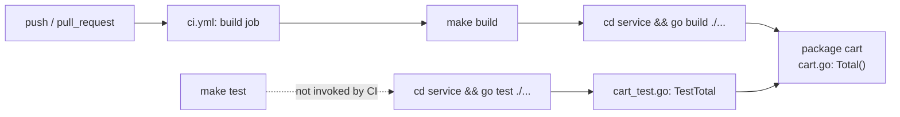

Everything lives in one Go module (`service/`, module path `example.com/rbecired`) with a single package `cart`. There's no service boundary, network call, or database here — the "architecture" is just: GitHub Actions → Makefile → `go build`/`go test` → the `cart` package.

The `test` Makefile target exists but the CI workflow only ever runs `make build` (`.github/workflows/ci.yml:18`) — see [gotchas](gotchas.md) for why that matters.
